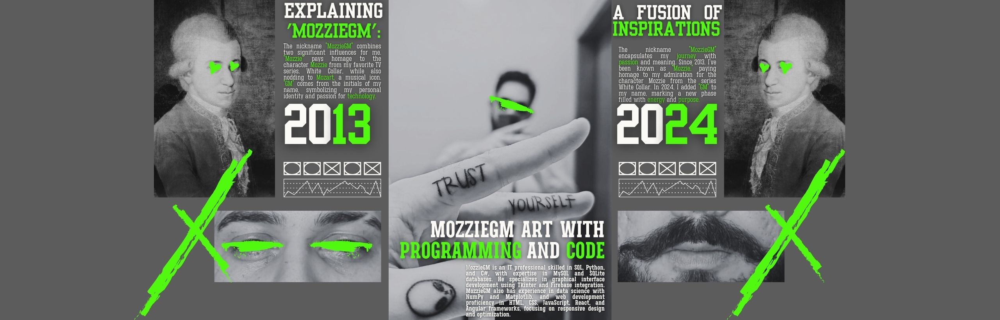

<!--título-->

    <h1>Hello World,  Welcome to My Crazy World!</h1>
    

    <h2>Passion for Programming 💻</h2>
    
Hello, I'm MozzieGM! I have a deep passion for programming, with extensive skills in languages like Python and Java, as well as experience in web development and data science. My journey began in 2013 as Mozzie, and in 2024, I adopted 'GM' to mark a new phase in my coding adventures.  <b>Let's create something amazing together!

    
    
    
    

    <h2>Technologies 💻</h2>
    
    
    
    
    
    
     
    
    
    
    
    

    <h2>Donation 💸</h2>
    

        <h2>Donate via Pix 💸</h2>
        
Scan the QR code below:

        
        

        

<h2>Donate via Zelle 💸</h2>
            
Scan the QR code below:

            
        

    

